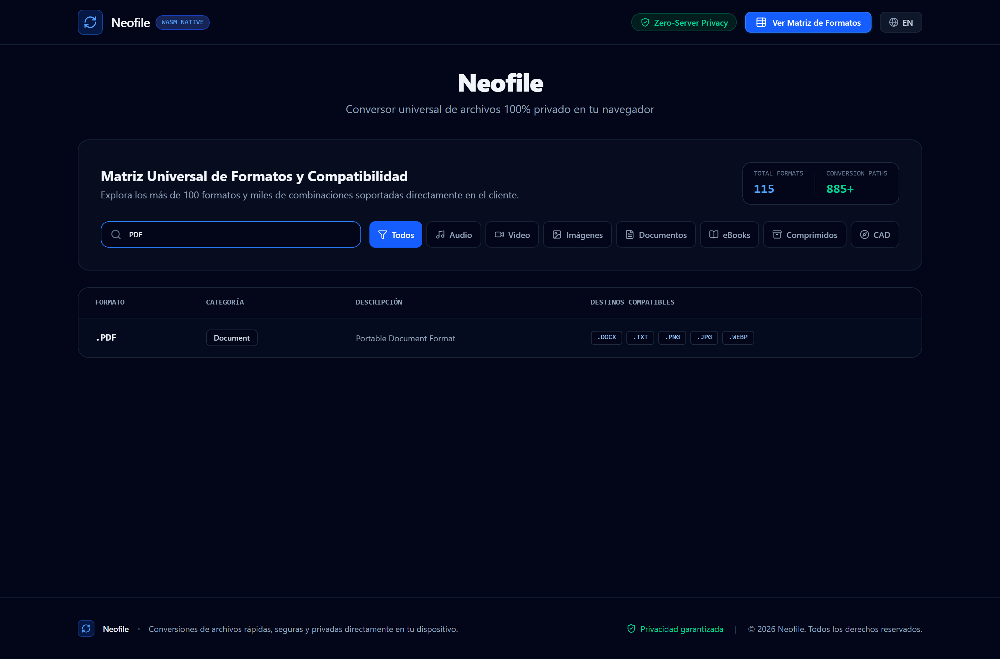

# Neofile - Conversor Universal Zero-Server

**Neofile** es una plataforma de conversión universal de archivos con procesamiento 100% en el cliente mediante **WebAssembly (WASM)**, **Web Workers** y **Arquitectura Hexagonal (Ports & Adapters)**.

Tus archivos **nunca se suben a ningún servidor**. La privacidad es absoluta y todo el procesamiento se realiza en la memoria local del navegador.

[English Version](README.en.md) | [Documentación de Arquitectura](docs/ARCHITECTURE.md) | [Guía de Commits](docs/CONVENTIONAL_COMMITS.md) | [Garantía de Privacidad](docs/PRIVACY_ZERO_SERVER.md)

---

## Capturas de Pantalla y Vista Previa

### 1. Pantalla Principal y Zona de Carga
Interface minimalista y limpia con selector de arrastrar y soltar, estadísticas de privacidad y soporte multitarea.


### 2. Cola de Conversión por Lotes
Gestión simultánea de conversiones con bloqueo de selector tras procesar, control de progreso individual y descargas automáticas (incluyendo paquetes ZIP para PDFs multipágina).


### 3. Explorador de Compatibilidad de Formatos
Buscador interactivo para consultar todas las combinaciones y rutas de conversión disponibles entre más de 100 formatos.



---

## Características Principales

- **Privacidad Total (Zero-Server)**: Sin backend que reciba archivos. Cero bytes transmitidos a servidores externos.
- **Más de 100 Formatos Soportados**: Cubre categorías completas de Audio, Video, Imágenes, Documentos, eBooks, Comprimidos y CAD.
- **Arquitectura Hexagonal**: Núcleo de dominio desacoplado de frameworks e implementaciones de motores de conversión.
- **Procesamiento por Lotes**: Conversión simultánea con control de concurrencia y descarga individual o agrupada en ZIP.
- **Detección Binaria**: Identificación de tipos de archivo mediante firmas *Magic Numbers* en lugar de basarse únicamente en la extensión.
- **Zero Emoji Standard**: Diseño profesional, limpio y tipográfico con iconografía SVG estructurada (Lucide Icons).
- **Internacionalización Bilingüe**: Soporte nativo para Español e Inglés con cambio dinámico en tiempo real.
- **Batería de Testeo Doble**: Tests unitarios de dominio y suite de QA automático de integración.

---

## Formatos Soportados por Categoría

| Categoría | Formatos Disponibles |
| :--- | :--- |
| **Audio** | `3GA`, `AAC`, `AC3`, `AIFF`, `FLAC`, `M4A`, `M4R`, `MIDI`, `MP3`, `OGG`, `RA`, `RAM`, `WAV`, `WMA` |
| **Video** | `3G2`, `3GP`, `3GPP`, `ASF`, `AVI`, `FLV`, `GVI`, `M4V`, `MKV`, `MOD`, `MOV`, `MP4`, `MPG`, `MTS`, `RM`, `RMVB`, `TS`, `VOB`, `WEBM`, `WMV` |
| **Imágenes** | `AI`, `AVIF`, `BMP`, `CDR`, `EMF`, `GIF`, `HEIC`, `JFIF`, `JPG`, `JPEG`, `ODG`, `PCX`, `PNG`, `PSD`, `SVG`, `TGA`, `TIFF`, `WBMP`, `WEBP`, `WMF`, `ICO` |
| **Documentos** | `CSV`, `DJVU`, `DOC`, `DOCM`, `DOCX`, `EML`, `EPS`, `HTML`, `JSON`, `MD`, `MSG`, `ODP`, `ODS`, `ODT`, `PDF`, `PPS`, `PPSX`, `PPT`, `PPTM`, `PPTX`, `PS`, `PUB`, `RTF`, `TEX`, `TXT`, `WKS`, `WPD`, `WPS`, `XLR`, `XLS`, `XLSM`, `XLSX`, `XPS` |
| **e-Books** | `AZW`, `AZW3`, `CBC`, `CBR`, `CBZ`, `CHM`, `EPUB`, `FB2`, `LIT`, `LRF`, `MOBI`, `PDB`, `PML`, `PRC`, `RB`, `TCR` |
| **Comprimidos**| `7Z`, `CAB`, `LZH`, `RAR`, `TAR`, `TAR.BZ2`, `TAR.GZ`, `YZ1`, `ZIP` |
| **CAD** | `DWG`, `DXF` |

---

## Estructura del Proyecto (Arquitectura Hexagonal)

```
neofile/
├── src/
│   ├── core/                           # Núcleo de Dominio y Aplicación (Puro TypeScript)
│   │   ├── domain/
│   │   │   ├── entities/               # Format, ConversionJob, FileItem, ConversionMatrix
│   │   │   ├── value-objects/          # ConversionOptions, ConversionProgress
│   │   │   └── ports/                  # IConversionEngine, IFormatDetector, ITelemetryPort
│   │   └── application/
│   │       ├── use-cases/              # ConvertFileUseCase, BatchConvertUseCase, DetectFormatUseCase
│   │       └── services/               # EngineRouterService
│   │
│   ├── infrastructure/                 # Adaptadores de Salida (Motores e Interfaces)
│   │   └── adapters/
│   │       ├── engines/                # ImageConversionAdapter, DocumentEngineAdapter, etc.
│   │       ├── detectors/              # MagicNumberDetectorAdapter
│   │       └── telemetry/              # LocalConsoleTelemetryAdapter
│   │
│   └── presentation/                   # Adaptador Primario (UI en React 19 + TailwindCSS)
│       ├── components/                 # Dropzone, Queue, MatrixExplorer, Navbar, Footer
│       ├── context/                    # ConversionContext, I18nContext
│       └── i18n/                       # Diccionarios ES / EN
│
├── tests/
│   ├── unit/                           # Tests unitarios del dominio
│   └── qa/                             # Tests automáticos de integración y runner maestro
└── docs/                               # Documentación técnica bilingüe
```

---

## Instalación y Ejecución

### Requisitos
- Node.js 20+ (probado en v26.3.0)
- npm 10+

### Pasos

1. **Instalar dependencias**:
   ```bash
   npm install
   ```

2. **Iniciar servidor de desarrollo**:
   ```bash
   npm run dev
   ```

3. **Ejecutar tests unitarios y QA automático**:
   ```bash
   npm run test:qa
   ```

4. **Compilar para producción**:
   ```bash
   npm run build
   ```

---

## Licencia

Código abierto bajo la licencia MIT.
