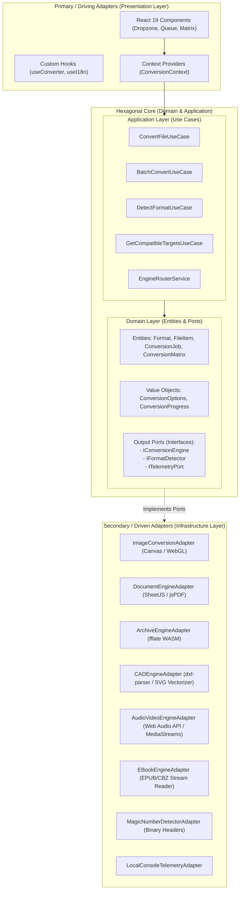
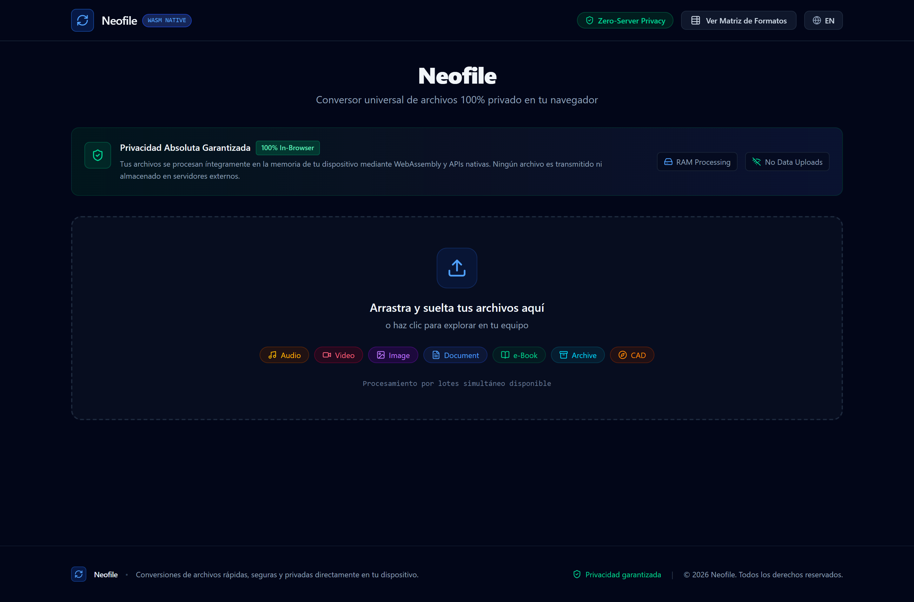
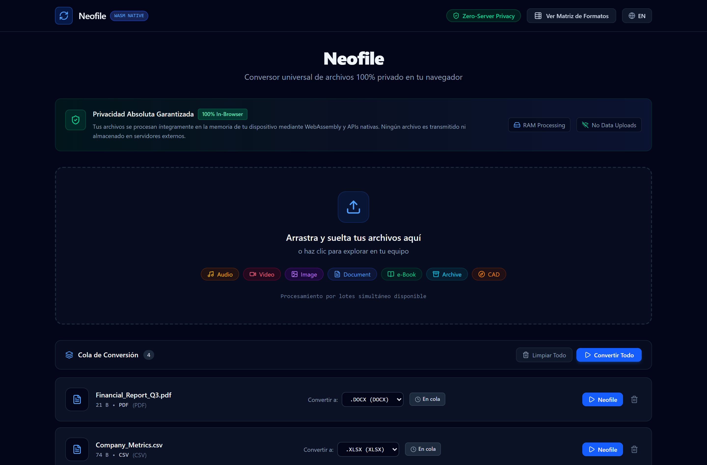

# Hexagonal Architecture Specification (Ports & Adapters)

## Overview

The **Neofile** platform strictly adheres to **Hexagonal Architecture (Ports and Adapters)** to decouple domain business logic and conversion workflows from specific browser APIs, UI rendering libraries, and file processing tools.

---

## Architectural Layers

---

## 1. Domain Layer (`src/core/domain/`)
- **Zero dependencies** on external UI frameworks or third-party web APIs.
- **Entities**:
  - `Format`: Represents all 100+ registered format definitions, categories, MIME types, and lossless flags.
  - `ConversionJob`: Manages the state machine (`queued`, `converting`, `completed`, `failed`), progress tracking, and converted artifact blobs.
  - `FileItem`: Encapsulates user files and formatted file size helpers.
  - `ConversionMatrix`: Calculates compatible target formats and validates conversion paths.
- **Ports (Output Interfaces)**:
  - `IConversionEngine`: Contract for executing format conversions.
  - `IFormatDetector`: Contract for binary inspection.
  - `ITelemetryPort`: Contract for logging conversion metrics without external transmission.

---

## 2. Application Layer (`src/core/application/`)
- Coordinates the execution of user intents.
- **Use Cases**:
  - `ConvertFileUseCase`: Coordinates status transitions, progress events, and routing to the right engine.
  - `BatchConvertUseCase`: Manages concurrent multi-file queues with concurrency limits.
  - `DetectFormatUseCase`: Resolves file types by combining binary magic numbers and extensions.
  - `GetCompatibleTargetsUseCase`: Queries target options for any format.
- **Services**:
  - `EngineRouterService`: Dynamically selects the appropriate engine based on `canHandle(sourceExt, targetExt)`.

---

## 3. Infrastructure Layer (`src/infrastructure/`)
- Implements the ports defined by the domain.
- Adapters can be modified, replaced, or upgraded (e.g. swapping Web Audio for FFmpeg WASM or Canvas for Magick WASM) without touching domain logic.

---

## 4. Presentation Layer (`src/presentation/`)
- Implements the primary driving adapter via React 19 and Tailwind CSS.
- Completely isolated from file processing mechanics through React Context and Custom Hooks.

### User Interface Preview

*Figure 1: Main Dropzone and Hero Interface (Zero-Server Guarantee)*

*Figure 2: Active Batch Conversion Queue with locked format selectors and real-time state management*

